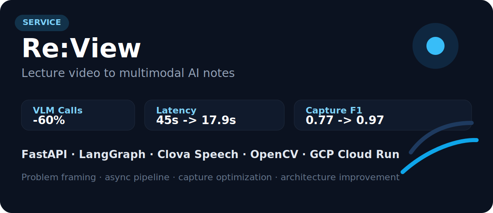
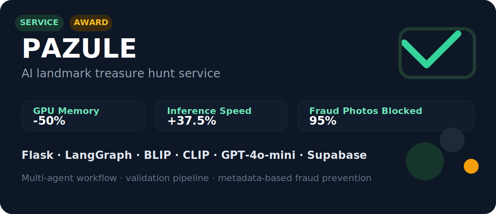
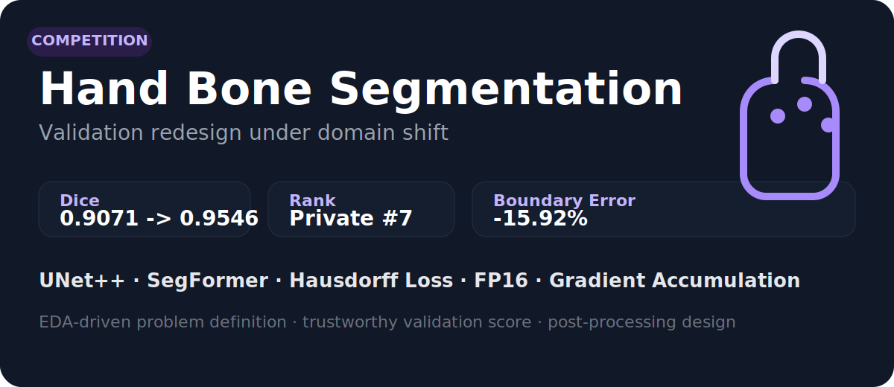

# 이상준 | AI / Backend Engineer

문제를 정의하고, 가설로 검증하고, 구조로 해결합니다.  
모델 성능 개선에서 끝나지 않고, AI 기능을 실제 서비스 구조와 운영 효율까지 연결하는 엔지니어를 지향합니다.

  
  
  

[Impact](#impact) · [Featured Projects](#featured-projects) · [How I Work](#how-i-work) · [Background](#background)

## About

- AI Engineer / Backend Engineer 포지션을 목표로, 멀티모달 AI 서비스와 실험 중심 프로젝트를 수행해왔습니다.
- Competition에서는 `Dice 0.9546`, `mAP 0.711`, `Macro F1 83.12%`를 만들었고, Service에서는 `VLM API 호출 60% 절감`, `GPU 메모리 50% 절감`, `실시간 처리 5초 이내` 성과를 냈습니다.
- 문제를 빠르게 구현하는 것보다, **무엇을 검증해야 하는지 정의하고 구조로 재현 가능한 결과를 만드는 과정**을 더 중요하게 생각합니다.

## Impact

| Area | Outcome |
| --- | --- |
| Re:View | ORB + pHash 기반 중복 제거로 **VLM API 호출 60% 절감** |
| PAZULE | BLIP FP16 적용으로 **GPU 메모리 50% 절감** |
| Live Commerce | Event-Driven Serverless 파이프라인으로 **5초 이내 처리** |
| Hand Bone Segmentation | Dice **0.9071 → 0.9546**, Private **7위** |
| Object Detection | mAP **0.684 → 0.711** |
| Sentiment Analysis | Macro F1 **78.5% → 83.12%** |

## Featured Projects

### Re:View

- 강의 영상을 독립형 강의 노트와 튜터 흐름으로 연결한 멀티모달 AI 서비스입니다.
- 맡은 일: 캡처 파이프라인 최적화, 백엔드 API 및 비동기 처리 구조 설계, 오디오 처리 개선, 아키텍처 개선안 문서화
- 핵심 성과: Clova WER **6%**, VLM API 호출 **60% 절감**, Summarizer 지연시간 **45s → 17.9s**, Capture F1 **0.77 → 0.97**
- Stack: `FastAPI`, `LangGraph`, `Gemini Flash`, `Clova Speech`, `OpenCV`, `Docker`, `GCP Cloud Run`
- Links: [GitHub](https://github.com/dltkdwns0730/Re-View) · [Notion](https://artistic-myrtle-971.notion.site/ReView-2f528309d08d805faa97d032c01a260d) · [Architecture Docs](https://github.com/dltkdwns0730/Re-View/blob/feature/architecture-improvement/docs/architecture-improvement.md)

### PAZULE

- 파주 출판단지 체험형 보물찾기 흐름을 AI 검증과 힌트 생성 파이프라인으로 연결한 서비스입니다.
- 맡은 일: 백엔드 리드, LangGraph 멀티에이전트 구조 설계, AI 검증 파이프라인 설계, 모델 경량화, GPS/EXIF 검증 로직 구현
- 핵심 성과: **파주시장상**, GPU 메모리 **50% 절감**, 추론 속도 **37.5% 향상**, 부정 사진 **95% 차단**
- Stack: `Flask`, `LangGraph`, `BLIP`, `CLIP`, `GPT-4o-mini`, `Docker`, `Supabase`
- Links: [GitHub](https://github.com/dltkdwns0730/PAZULE_AGENT) · [Notion](https://artistic-myrtle-971.notion.site/2f528309d08d80ffb5f3ec0977fb2854)

### Hand Bone Segmentation

- Domain Shift가 큰 Hand Bone X-ray 데이터에서 검증 기준과 학습 전략을 다시 설계한 Competition 프로젝트입니다.
- 맡은 일: EDA 기반 문제 정의, 데이터 재설계, 검증 지표 설계, 학습 전략 수립, 후처리 파이프라인 설계
- 핵심 성과: Dice **0.9071 → 0.9546 (+5.2%p)**, Private **7위**, 경계 밖 픽셀 평균 **15.92% 감소**
- Stack: `UNet++`, `SegFormer`, `Hausdorff Loss`, `FP16`, `Gradient Accumulation`, `WandB`
- Links: [GitHub](https://github.com/dltkdwns0730/pro-cv-semanticsegmentation-cv-02) · [Notion](https://artistic-myrtle-971.notion.site/Hand-Bone-Image-Segmentation-2f528309d08d803482dde529f91f75ed)

## Other Projects

| Project | Focus | Result | Links |
| --- | --- | --- | --- |
| Live Commerce | AWS IVS, Rekognition, Lambda, DynamoDB를 연결한 Event-Driven Serverless 파이프라인 설계 | **5초 이내 처리**, **100% Serverless** | [Notion](https://artistic-myrtle-971.notion.site/2f628309d08d8075bba5eee8ab9cfc7b) |
| Object Detection | Transformer 계열 탐지 모델의 메모리 제약을 고려한 변인 통제 기반 실험 설계 | mAP **0.684 → 0.711** | [GitHub](https://github.com/dltkdwns0730/pro-cv-objectdetection-cv-02) · [Notion](https://artistic-myrtle-971.notion.site/Trash-Detection-2c928309d08d80e998b3c4273a990586) |
| Sentiment Analysis | 클래스 불균형과 도메인 적응을 함께 고려한 감정 분류 실험 | Macro F1 **78.5% → 83.12%** | [Notion](https://artistic-myrtle-971.notion.site/2f528309d08d8054aa88c91d54cae9f7) |

## How I Work

- **Problem First**: 좋은 결과는 좋은 모델 하나보다, 문제를 정확히 정의하고 검증 가능한 가설로 쪼개는 과정에서 나온다고 믿습니다.
- **Data-Centric**: 모델을 바꾸기 전에 데이터 분포, 실패 케이스, 평가 기준부터 확인하는 편입니다.
- **Ownership**: 모델 성능 개선에 그치지 않고, 서비스 구조와 운영 효율까지 함께 책임지는 엔지니어를 지향합니다.
- **Teamwork**: Git-flow, PR 리뷰, WandB, Notion 기록 규칙을 맞추고, 실험 인사이트를 팀 자산으로 남깁니다.

## Background

### Education

- **네이버 부스트캠프 AI Tech 8기** | Computer Vision Track | 2025.09 - 2026.02
- **한림대학교 소프트웨어학부 빅데이터전공** | GPA 3.59 / 4.50 | 2021.03 - 2025.02

### Activities & Awards

- **데이콘 파주 아이디어 혁신 대회** | PAZULE 팀 프로젝트 | **파주시장상** | 2025.12.22
- **Hand Bone Image Segmentation Competition** | Private **7위** / Public **7위**

### Certifications & Language

- 정보처리기사
- 빅데이터분석기사
- ADsP
- TOEIC 920
- OPIc IH
